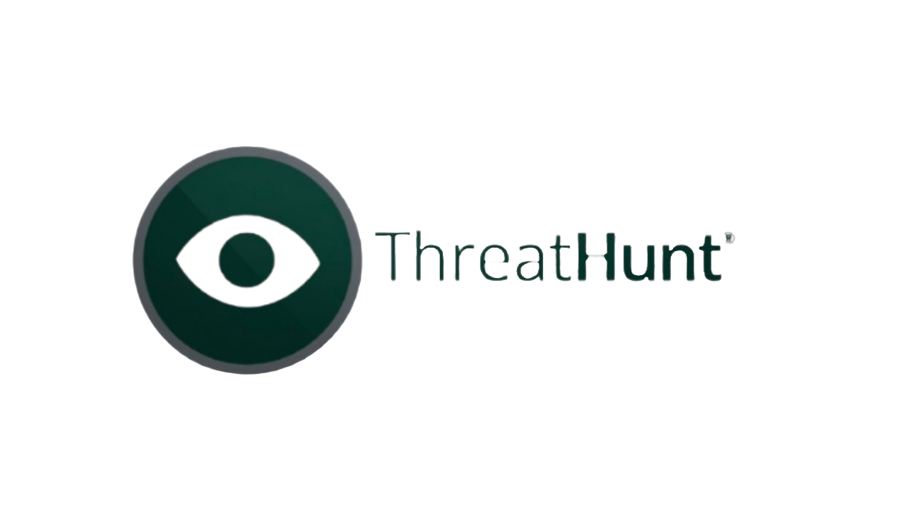

# ThreatHunt — OSINT Automated Security Platform

<div align="center">




</div>

**ThreatHunt** is an OSINT-focused cybersecurity web platform designed for automated open-source intelligence gathering and analysis. Users can configure passive and active scans against domains, IP addresses or organizations, selecting from a suite of integrated tools — and receive structured, downloadable HTML reports with all findings.

🌐 **Platform:** [https://threathunt.solutions](https://threathunt.solutions) · 🇪🇸 [Versión en español](#threathunt--plataforma-de-seguridad-osint-automatizada)

---

## Demo

> 📹 Full platform walkthrough — registration → scan configuration → tool execution → report download.

[](https://www.youtube.com/watch?v=Q3JIIKOnUDI)

---

## How it works

1. Register at [threathunt.solutions](https://threathunt.solutions) and create your account.
2. Log in and access the dashboard.
3. Click **New Scan**, enter a target domain and select the scan type (passive or active).
4. Choose the tools you want to run and configure your API keys if needed.
5. The platform executes all selected tools autonomously, organising results by asset.
6. Download the full HTML report from **My Scans**.

---

## Architecture overview

- **Infrastructure:** AWS-based deployment using EC2 instances (t4g.medium, Graviton), VPC with public/private subnets, and an Application Load Balancer (ALB) with Auto Scaling (1–2 instances on demand).
- **Backend:** Python + Flask orchestrator (`main.py`) running OSINT tools in sequence, storing structured results in MongoDB. Each scan creates entries for assets, findings and relationships.
- **Frontend:** Web dashboard built with a 3-step scan wizard (target → tool selection → review & launch), real-time scan status updates every 5 seconds, and report export.
- **Database:** MongoDB Replica Set (primary + secondary nodes) deployed in private subnets for high availability. Collections: `scans`, `assets`, `relationships`, `users`.
- **Security:** AWS WAF with Anonymous IP list, Core rule set, Known bad inputs and Amazon IP reputation list. Authentication system with per-user profile and API key management. S3 bucket with AES-256 encryption and versioning for backups.
- **Monitoring:** AWS CloudWatch with CPU and latency alarms, access and error logging per scan execution via Python's logging module.

---

## Integrated tools

| Tool | Type | Description |
|------|------|-------------|
| Crt.sh | Passive | Certificate transparency log search |
| DNSRecon | Passive | DNS enumeration and zone transfer analysis |
| Shodan | Passive | Internet-connected device and service discovery |
| VirusTotal | Passive | Subdomain discovery and reputation analysis |
| Wappalyzer | Passive | Web technology fingerprinting |
| WHOIS (apilayer) | Passive | Domain registration information |
| Hunter.how | Passive | Complementary device and service data |
| Subfinder | Planned | Subdomain enumeration |
| Gobuster | Planned | Directory and file enumeration |
| Nikto | Planned | Web server vulnerability scanning |
| Google Dorks | Planned | Advanced indexed data discovery |
| Intelligence X | Planned | Dark web and historical data search |
| Nuclei | Planned | Template-based vulnerability detection |
| CloudEnum | Planned | Cloud infrastructure enumeration |

---

## Key features

- **Passive & active scans:** Passive mode collects information without interacting with the target. Active mode (in development) enables deeper auditing and exploitation validation.
- **Per-user scan history:** Every scan is persisted in MongoDB, accessible and deletable from the user dashboard.
- **HTML reports:** Results are exported as downloadable HTML files with an integrated search bar to filter by IP, domain or other attributes.
- **API key management:** Users configure their own API keys per tool from their profile, maximising scan quality without sharing credentials.
- **Asset-centric data model:** Scans are structured around discovered assets — subdomains, IPs, services — each with its own findings from every selected tool.

---

## Tech stack

| Layer | Technologies |
|-------|-------------|
| Backend | Python, Flask, OOP tool modules |
| Frontend | HTML/CSS/JS, 3-step scan wizard |
| Database | MongoDB Replica Set (HA), S3 (backups) |
| Infrastructure | AWS EC2, VPC, ALB, Auto Scaling, CloudFormation |
| Security | AWS WAF, CloudWatch, CloudTrail |
| OSINT toolkit | Crt.sh, DNSRecon, Shodan, VirusTotal, Wappalyzer, WHOIS, Hunter.how |

---

## Installation

```bash
# Clone the repository
git clone https://github.com/gvmmo/threathunt.git
cd threathunt

# Set up Python environment
python3 -m venv venv
source venv/bin/activate
pip install -r requirements.txt

# Start MongoDB with Docker
docker-compose up -d

# Configure environment variables
cp .env.example .env
# Edit .env with your MongoDB URI and API keys

# Install system tools
sudo apt-get install -y gobuster subfinder nuclei nikto dnsrecon
# Or use the provided installer:
python install.py

# Run the application
python run.py
# App runs at http://localhost:3000
```

---

## Team

| Name | Role |
|------|------|
| Ayman Dghoughi Nouri | AWS infrastructure · VPC & networking · MongoDB HA · WAF · S3 · Security |
| Ian Díaz | Backend development · OSINT tool integration · MongoDB setup |
| Amritpal Singh | Frontend development · UI/UX · Authentication system |

---
---

# ThreatHunt — Plataforma de Seguridad OSINT Automatizada

<div align="center">


</div>

**ThreatHunt** es una plataforma web de ciberseguridad orientada a OSINT, diseñada para la recopilación y análisis automatizado de información de fuentes abiertas. Los usuarios pueden configurar escaneos pasivos y activos sobre dominios, direcciones IP u organizaciones, seleccionando entre un conjunto de herramientas integradas, y recibir informes HTML estructurados y descargables con todos los hallazgos.

🌐 **Plataforma en producción:** [https://threathunt.solutions](https://threathunt.solutions)

---

## Demo

> 📹 Recorrido completo por la plataforma — registro → configuración del escaneo → ejecución de herramientas → descarga del informe.

[](https://www.youtube.com/watch?v=Q3JIIKOnUDI)

---

## Cómo funciona

1. Regístrate en [threathunt.solutions](https://threathunt.solutions) y crea tu cuenta.
2. Inicia sesión y accede al dashboard.
3. Haz clic en **New Scan**, introduce un dominio objetivo y selecciona el tipo de escaneo (pasivo o activo).
4. Elige las herramientas que quieres ejecutar y configura tus API keys si es necesario.
5. La plataforma ejecuta todas las herramientas seleccionadas de forma autónoma, organizando los resultados por activo.
6. Descarga el informe HTML completo desde **My Scans**.

---

## Visión general de la arquitectura

- **Infraestructura:** Despliegue en AWS con instancias EC2 (t4g.medium, Graviton), VPC con subredes públicas y privadas, y un Application Load Balancer (ALB) con Auto Scaling (1–2 instancias según demanda).
- **Backend:** Orquestador Python + Flask (`main.py`) que ejecuta las herramientas OSINT en secuencia y almacena los resultados estructurados en MongoDB. Cada escaneo crea entradas para activos, hallazgos y relaciones.
- **Frontend:** Dashboard web con un asistente de escaneo de 3 pasos (objetivo → selección de herramientas → revisión y lanzamiento), actualizaciones del estado del escaneo cada 5 segundos y exportación de informes.
- **Base de datos:** MongoDB Replica Set (nodo primario + secundario) desplegado en subredes privadas para alta disponibilidad. Colecciones: `scans`, `assets`, `relationships`, `users`.
- **Seguridad:** AWS WAF con Anonymous IP list, Core rule set, Known bad inputs y Amazon IP reputation list. Sistema de autenticación con perfil por usuario y gestión de API keys. Bucket S3 con cifrado AES-256 y versionado para backups.
- **Monitorización:** AWS CloudWatch con alarmas de CPU y latencia, registro de accesos y errores por ejecución de escaneo mediante el módulo logging de Python.

---

## Herramientas integradas

| Herramienta | Tipo | Descripción |
|-------------|------|-------------|
| Crt.sh | Pasiva | Búsqueda en registros de transparencia de certificados |
| DNSRecon | Pasiva | Enumeración DNS y análisis de transferencias de zona |
| Shodan | Pasiva | Descubrimiento de dispositivos y servicios conectados a Internet |
| VirusTotal | Pasiva | Descubrimiento de subdominios y análisis de reputación |
| Wappalyzer | Pasiva | Identificación de tecnologías web |
| WHOIS (apilayer) | Pasiva | Información de registro de dominio |
| Hunter.how | Pasiva | Datos complementarios de dispositivos y servicios |
| Subfinder | Planificada | Enumeración de subdominios |
| Gobuster | Planificada | Enumeración de directorios y archivos |
| Nikto | Planificada | Escaneo de vulnerabilidades en servidores web |
| Google Dorks | Planificada | Descubrimiento de datos indexados sensibles |
| Intelligence X | Planificada | Búsqueda en dark web y datos históricos |
| Nuclei | Planificada | Detección de vulnerabilidades por plantillas |
| CloudEnum | Planificada | Enumeración de infraestructura cloud |

---

## Características principales

- **Escaneos pasivos y activos:** El modo pasivo recopila información sin interactuar con el objetivo. El modo activo (en desarrollo) permite auditorías más profundas y validación de vulnerabilidades explotables.
- **Historial de escaneos por usuario:** Cada escaneo se persiste en MongoDB, accesible y eliminable desde el dashboard del usuario.
- **Informes HTML:** Los resultados se exportan como archivos HTML descargables con una barra de búsqueda integrada para filtrar por IP, dominio u otros atributos.
- **Gestión de API keys:** Los usuarios configuran sus propias claves por herramienta desde su perfil, maximizando la calidad de los escaneos sin compartir credenciales.
- **Modelo de datos centrado en activos:** Los escaneos se estructuran en torno a los activos descubiertos — subdominios, IPs, servicios — cada uno con sus propios hallazgos de cada herramienta seleccionada.

---

## Tech stack

| Capa | Tecnologías |
|------|-------------|
| Backend | Python, Flask, módulos OOP por herramienta |
| Frontend | HTML/CSS/JS, asistente de escaneo 3 pasos |
| Base de datos | MongoDB Replica Set (HA), S3 (backups) |
| Infraestructura | AWS EC2, VPC, ALB, Auto Scaling, CloudFormation |
| Seguridad | AWS WAF, CloudWatch, CloudTrail |
| Toolkit OSINT | Crt.sh, DNSRecon, Shodan, VirusTotal, Wappalyzer, WHOIS, Hunter.how |

---

## Instalación

```bash
# Clonar el repositorio
git clone https://github.com/gvmmo/threathunt.git
cd threathunt

# Configurar entorno Python
python3 -m venv venv
source venv/bin/activate
pip install -r requirements.txt

# Iniciar MongoDB con Docker
docker-compose up -d

# Configurar variables de entorno
cp .env.example .env
# Editar .env con tu URI de MongoDB y API keys

# Instalar herramientas del sistema
sudo apt-get install -y gobuster subfinder nuclei nikto dnsrecon
# O usar el instalador incluido:
python install.py

# Ejecutar la aplicación
python run.py
# La app corre en http://localhost:3000
```

---

## Equipo

| Nombre | Rol |
|--------|-----|
| Ayman Dghoughi Nouri | Infraestructura AWS · VPC y redes · MongoDB HA · WAF · S3 · Seguridad |
| Ian Díaz | Desarrollo backend · Integración herramientas OSINT · Configuración MongoDB |
| Amritpal Singh | Desarrollo frontend · UI/UX · Sistema de autenticación |
