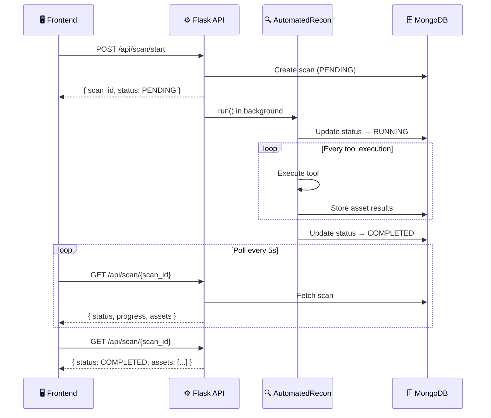

# API Reference — ThreatHunt

## Base URL

```
http://localhost:3000/api    # local development
```

All endpoints accept and return `application/json`.

---

## Authentication

Currently, endpoints are scoped by `user_id` passed in the request body. Full JWT authentication is planned for a future release.

---

## Endpoints

### Start a scan

```
POST /api/scan/start
```

Launches a new scan with the specified configuration. The scan runs in the background — use the returned `scan_id` to poll for status.

**Request body**

```json
{
  "target": "example.com",
  "target_type": "domain",
  "scan_type": "passive",
  "tools": ["crtsh", "dnsrecon", "shodan", "virustotal", "wappalyzer"],
  "user_id": "user_abc123",
  "active_targets": []
}
```

| Field | Type | Required | Description |
|-------|------|----------|-------------|
| `target` | string | ✅ | Domain or IP address to scan |
| `target_type` | string | ✅ | `"domain"` or `"ip"` |
| `scan_type` | string | ✅ | `"passive"` or `"active"` |
| `tools` | string[] | ✅ | List of tool identifiers to run |
| `user_id` | string | ✅ | User identifier for scan ownership |
| `active_targets` | string[] | ❌ | Additional targets for active scanning |

**Response `200 OK`**

```json
{
  "scan_id": "64f1a2b3c4d5e6f7a8b9c0d1",
  "status": "PENDING",
  "created_at": "2025-06-04T12:00:00Z"
}
```

---

### Get scan status

```
GET /api/scan/{scan_id}
```

Returns the current status and results of a scan. Poll this endpoint every 5 seconds while status is `RUNNING`.

**Path parameters**

| Parameter | Description |
|-----------|-------------|
| `scan_id` | MongoDB ObjectId returned by the start endpoint |

**Response `200 OK`**

```json
{
  "scan_id": "64f1a2b3c4d5e6f7a8b9c0d1",
  "status": "RUNNING",
  "target": "example.com",
  "scan_type": "passive",
  "progress": 60,
  "assets": [
    {
      "asset": "sub.example.com",
      "type": "subdomain",
      "findings": {
        "crtsh": { "certificates": [...] },
        "shodan": { "ports": [80, 443], "services": [...] }
      }
    }
  ],
  "created_at": "2025-06-04T12:00:00Z",
  "updated_at": "2025-06-04T12:01:30Z"
}
```

**Possible status values**

| Status | Description |
|--------|-------------|
| `PENDING` | Scan created, not yet started |
| `RUNNING` | Tools executing |
| `COMPLETED` | All tools finished, report available |
| `FAILED` | Scan failed — check `error` field |

---

### Get user scans

```
GET /api/scans/user/{user_id}?limit=10
```

Returns the most recent scans for a given user.

**Path parameters**

| Parameter | Description |
|-----------|-------------|
| `user_id` | User identifier |

**Query parameters**

| Parameter | Default | Description |
|-----------|---------|-------------|
| `limit` | `10` | Maximum number of scans to return |

**Response `200 OK`**

```json
[
  {
    "scan_id": "64f1a2b3c4d5e6f7a8b9c0d1",
    "target": "example.com",
    "scan_type": "passive",
    "status": "COMPLETED",
    "created_at": "2025-06-04T12:00:00Z"
  }
]
```

---

### Get available tools

```
GET /api/tools
```

Returns the list of available tools grouped by scan type.

**Response `200 OK`**

```json
{
  "passive": [
    { "id": "crtsh", "name": "Crt.sh", "requires_api_key": false },
    { "id": "dnsrecon", "name": "DNSRecon", "requires_api_key": false },
    { "id": "shodan", "name": "Shodan", "requires_api_key": true },
    { "id": "virustotal", "name": "VirusTotal", "requires_api_key": true },
    { "id": "wappalyzer", "name": "Wappalyzer", "requires_api_key": false },
    { "id": "whois", "name": "WHOIS", "requires_api_key": true },
    { "id": "hunterhow", "name": "Hunter.how", "requires_api_key": true }
  ],
  "active": []
}
```

---

## Error responses

All errors follow the same structure:

```json
{
  "detail": "Human-readable error message"
}
```

| HTTP code | Meaning |
|-----------|---------|
| `400` | Bad request — invalid input |
| `404` | Scan or user not found |
| `422` | Validation error — check request body |
| `500` | Internal server error |

---

## Scan flow diagram


