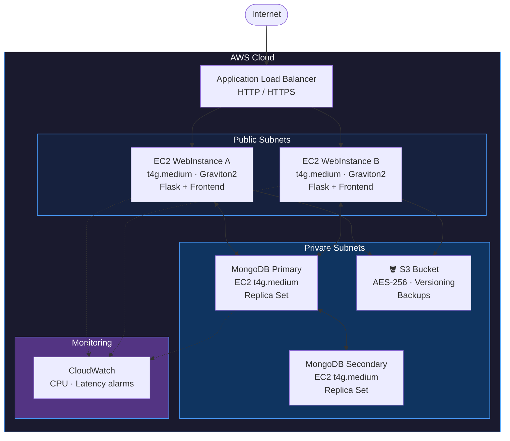
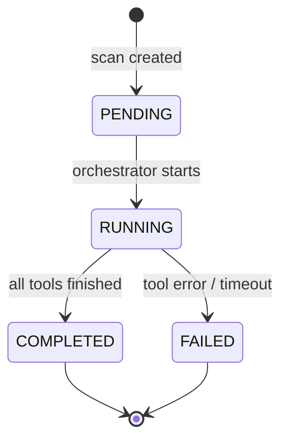

# Architecture — ThreatHunt
 
## Overview
 
ThreatHunt is deployed on AWS using a multi-tier architecture with separated public and private subnets, high-availability database replication, and a Flask-based backend orchestrating all OSINT tool execution.
 
---
 
## Infrastructure diagram
 

 
---
 
## Components
 
### Web tier (public subnets)
 
- Two EC2 `t4g.medium` instances (AWS Graviton2, ARM64) running Flask + frontend
- Auto Scaling configured: 1–2 instances based on CPU demand
- ALB distributes traffic across both instances
- CloudFormation used for initial infrastructure deployment
### Database tier (private subnets)
 
- Two EC2 `t4g.medium` instances running MongoDB in Replica Set mode (primary + secondary)
- No direct internet access — reachable only from web tier via port 27017
- Keyfile-based authentication between replica nodes
- Collections: `scans`, `assets`, `relationships`, `users`
### Storage
 
- S3 bucket for scan result backups and static data
- AES-256 server-side encryption enabled by default
- Object versioning enabled to prevent accidental data loss
### Monitoring
 
- AWS CloudWatch configured with alarms:
  - CPU > 80% for 5 minutes on web instances
  - ALB latency > 500ms
- Python `logging` module generates per-scan log files with timestamps
- Log files stored in `logs/` directory: `access.log`, `error.log`, per-scan execution logs
---
 
## Network architecture
 
| Subnet type | Contents | Internet access |
|-------------|----------|-----------------|
| Public | Web instances, ALB | Yes (via IGW) |
| Private | MongoDB nodes | No (isolated) |
 
Security groups per tier:
- **Web instances:** inbound HTTP (80), HTTPS (443), SSH from specific IPs only
- **MongoDB instances:** inbound port 27017 from web instances only
---
 
## Backend orchestration flow

```mermaid
flowchart LR
    Request["POST /api/scan/start"] --> Validate["Validate\ntarget & config"]
    Validate --> AutoRecon["AutomatedRecon\norchestrator"]
 
    AutoRecon --> Tools
 
    subgraph Tools ["Tool Execution (sequential)"]
        T1["Crt.sh"]
        T2["DNSRecon"]
        T3["Shodan"]
        T4["VirusTotal"]
        T5["Wappalyzer"]
        T6["WHOIS"]
        T7["Hunter.how"]
    end
 
    Tools --> Normalise["Normalise\nresults per asset"]
    Normalise --> MongoDB["MongoDBHandler\nstore results"]
    MongoDB --> Report["Generate\nHTML report"]
    Report --> Done["COMPLETED"]
 
    style Tools fill:#0f3460,stroke:#4a9eff,color:#fff
```
 

 
---
 
## Scan status flow
 

 
---
 
## MongoDB data model
 
```
scans        → scan metadata, status, timestamps, config
assets       → discovered assets per scan (subdomains, IPs, services)
relationships → links between assets
users        → user accounts, hashed passwords, API keys per tool
```
 
---
 
## Local development setup
 
For development and testing, MongoDB runs in a Docker container instead of the AWS replica set:
 
```bash
docker-compose up -d   # starts MongoDB locally
python run.py          # starts Flask at http://localhost:3000
```
 
The `.env` file controls which MongoDB URI is used, making the switch between local and production transparent to the application.
